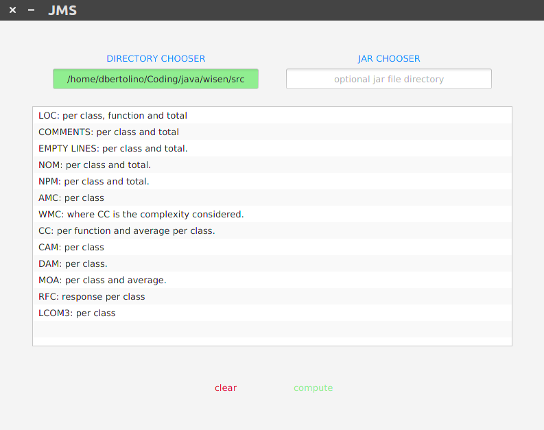
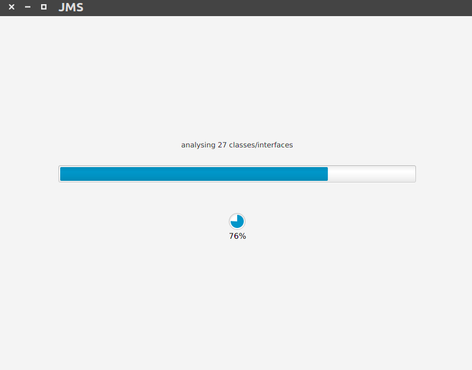

# A tool to analyse Java code quality 

__For complete documentation about the work, please refer to bachelor_thesis.pdf__

The aim of this tool is to receive in input Java code or Java compiled code and calculates the following quality metrics:
* Lines of code (LOC) 
* Number of methods and number of public methods (NOM - NPM) 
* verage method complexity (AMC) 
* Cyclomatic complexity (CC) 
* Weighted method per class (WMC) 
* Cohesion among methods of class (CAM) 
* Data Access metric (DAM) 
* Measure of Aggregation (MOA) 
* Response for a class (RFC) 
* Lack of Cohesion in methods (LCOM3) 
* Coupling between objects (CBO) 
* Depth of Inheritance tree (DIT) 
* Number of Children (NOC)

The software is built on top of ANTLR4 compiler generated with an open-source Java8 grammar. It provides a JavaFX GUI and the possibility to print the results in three different .csv files, each one represents a depth level of the analysis: Overview, Classes and single methods.

"Input scene"

"Computational progress scene"

 # INFO

The "generated" package contains classes generated with ANTLR4 thanks to an open source Java8 grammar.
The software can take in inpu:
 - single java class or a folder in which it will automatically search for all java classes.
 - (OPTIONAL) jar file in which it will search for the compiled classes previously found as code.

If the jar file is loaded also an analysis of the Inheritance three and objects relations will be performed.

At the end of the process, all the data collected can be printed in three csv files, one for every level of inspection, single methods, classes and total.

This project is licensed under the terms of the Apache 2.0 License.
